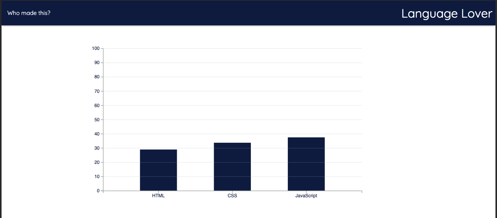

# languageLover
A script that uses D3.js and the github api to compile a bar graph that shows the percentage of each language used across all of a user's repositories.

## How does it work?

#### linking dependencies

Below are the links you will need in your HTML Head for language-lover.js to function properly

you can find the up-to-date links below:
* https://d3js.org/
* https://jquery.com/

#### setting up the script 

