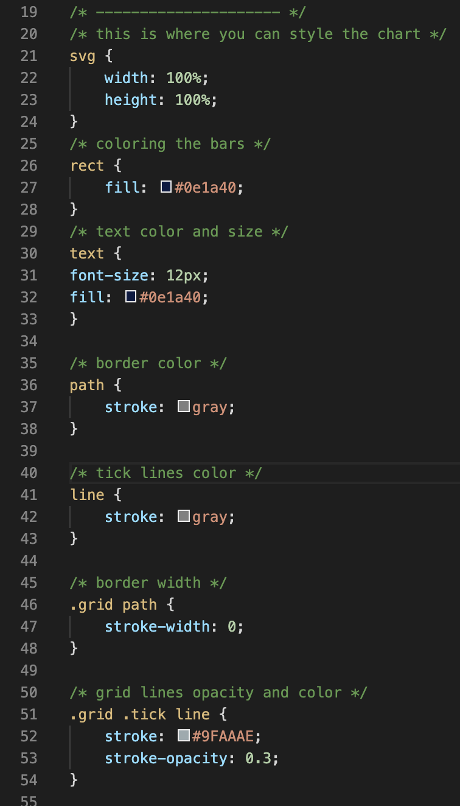

# languageLover
A script that uses D3.js and the github api to compile a bar chart that shows the percentage of each language used across all of a user's repositories.

https://logantwalker.github.io/languageLover/index.html

## How does it work?
...
#### linking dependencies:

Below are the links you will need in your HTML Head for language-lover.js to function properly

you can find the up-to-date links below:
* https://d3js.org/
* https://jquery.com/

#### setting up the script:

Enter your github username as a string on line 1 of language-lover.js

#### formatting the height & width of the chart:

change the value that "innerWidth" or "innerHeight" is divided by to change the width/height of the chart in relation to window size

#### styling the chart:

Follow the comments in style.css to format the chart's styling. You can also learn more by checking out the [D3.js Documentation](https://github.com/d3/d3/wiki).

